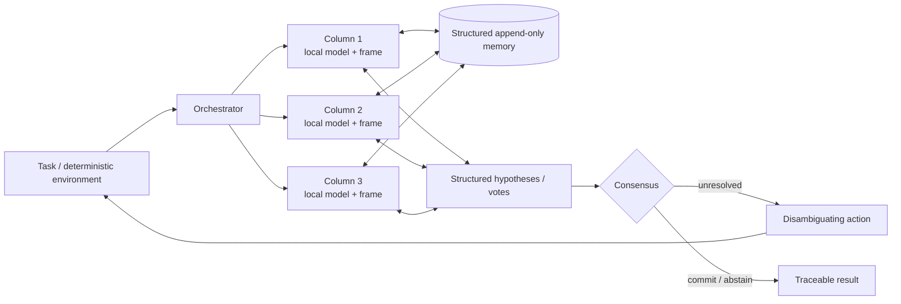

# Cortical-Column Memory (CCM)

**Research status: Protocol published / registered evaluation pending**<br>
**Release:** v0.1.0 · **Author:** James Booth · **License:** MIT for code, CC BY 4.0 for the paper

This repository proposes Cortical-Column Memory (CCM), a Thousand-Brains-inspired engineering architecture for resource-constrained multi-agent systems. The research question is whether explicit modular memory, navigable reference frames, distributed hypotheses, active evidence gathering, and structured consensus can recover some capabilities associated with larger models, and whether any benefit remains when inference, latency, communication, energy, and cost budgets are controlled. CCM is not presented as a biologically realistic model of the neocortex. The registered empirical campaign has not yet been completed; this release publishes the architecture, implementation, hypotheses, baselines, metrics, and decision rules before final data collection.

## Architecture



The software mapping is explicit: a reference frame is a state space with locations and validated transitions; a column owns local observations and candidate hypotheses; memory stores immutable observations with provenance; voting groups compatible structured hypotheses; and the active-evidence policy chooses an available action by expected information gain per cost. `abstained` and `unresolved` are valid outcomes.

## Quick start

The runtime uses Python 3.10+ and the standard library only. From a clean checkout:

```bash
./scripts/setup
./scripts/run_smoke
./scripts/analyze results/raw/ccm-smoke-v0.1.0.jsonl
```

The smoke command runs a small deterministic symbolic adapter across the registered task classes and writes a complete manifest, JSONL trace, summary, and generated LaTeX table. It is a software validation artifact, not evidence for the scientific hypotheses. Expected hardware is any machine with Python 3.10+; no GPU, network, API key, or model download is required.

The registered command is separate:

```bash
./scripts/run_registered
```

It executes the frozen v0.1.0 configuration using the symbolic adapter unless a future model adapter is explicitly wired in. Its outputs must be reviewed against the preregistered protocol before being called an empirical release.

## Paper and documentation

- [Compiled paper](paper/build/main.pdf) — generated from [`paper/main.tex`](paper/main.tex).
- [Architecture specification](docs/architecture.md)
- [Reproduction guide](docs/reproduction.md)
- [Experiment guide](docs/experiment-guide.md)
- [Preregistration protocol](preregistration/protocol.md)
- [Release checklist](RELEASE_CHECKLIST.md)

## Baselines and ablations

The frozen matrix includes B0 single-model direct inference, B1 equivalent context, B2 self-consistency, B3 conventional multi-agent inference, B4 majority vote, B5 confidence-weighted aggregation, CCM-Full, and component ablations for reference frames, active evidence, structured vote, structured memory, and specialization. Every run records a configuration hash, seed, git commit, model/task versions, hardware metadata, resources, and a provenance-bearing trace.

## Repository layout

```text
ccm/                  Reference-frame, memory, column, consensus, and orchestration contracts
experiments/          Versioned synthetic worlds, baselines, configs, and runners
evaluation/           Metrics, failure taxonomy, resource accounting, and reporting
tests/                Unit, integration, invariant, regression, and smoke tests
preregistration/      Frozen hypotheses, metrics, protocol, and registered configs
paper/                LaTeX source, bibliography, generated tables, and build output
docs/                 Architecture, reproduction, and experiment documentation
results/              Smoke raw JSONL, manifests, and generated summaries
scripts/              Setup, smoke, registered, analysis, and paper-build entry points
```

## Scope and limitations

This repository does not claim that CCM beats any model, that it is equivalent to cortical computation, or that additional inference is free. The protocol explicitly controls test-time resources and includes a pure-reasoning control. Final registered results will be published whether they support, qualify, or reject the hypotheses. Hosted-model adapters, hardware energy measurement, external datasets, and website publication are outside v0.1.0.

## Citation

```bibtex
@software{booth_ccm_2026,
  author  = {James Booth},
  title   = {Cortical-Column Memory: A Thousand-Brains-Inspired Memory and Consensus Architecture for Resource-Constrained Multi-Agent Systems},
  version = {0.1.0},
  year    = {2026},
  url     = {https://github.com/jmsbooth/agentic-cortical-column-memory}
}
```

See [`CITATION.cff`](CITATION.cff). The paper and code have separate licensing notices; generated datasets and third-party model outputs must retain their own provenance and licensing terms.
